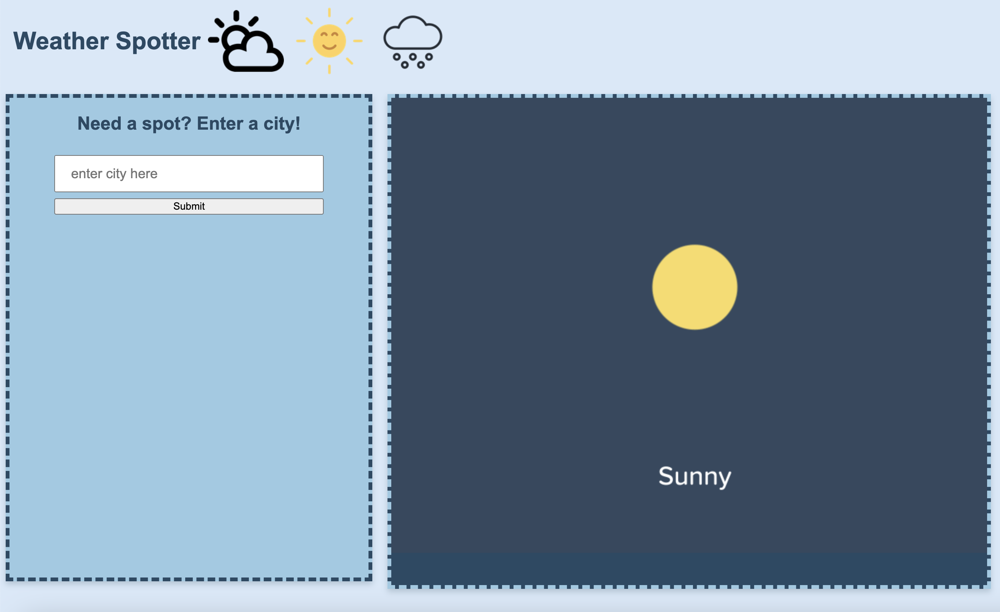

<h1> Weather Spotter</h1>
<h3> Whether you're at home or on the go, Weather Spotter can spot the weather for you. The easy-to-use search function allows you to enter a city of your choosing and provides data such as weather conditions, temperature, humidity and wind speed. Try it today! </h3>

<h4> Visit us at <a href="https://scurvyirv.github.io/weather-spotter/"> 
Weather Spotter</a> to get a spot on your weather forecast </h4>

